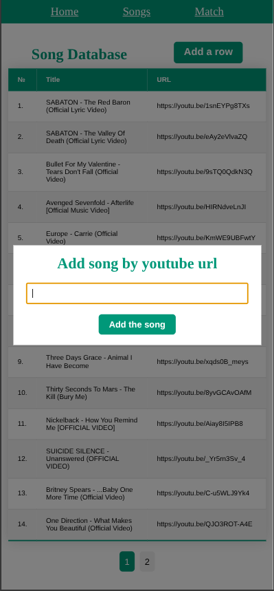

# Song Recognition

## Description

This is a web-based song recognition application built with Go for the backend and JavaScript for the frontend. Users can add songs via YouTube links, and the application processes them by generating spectrograms and extracting unique audio fingerprints.

After adding songs, the app can listen to a 20-second audio sample through your microphone and identify the matching track based on the stored fingerprints.

The main features include:

-   🔗 Adding songs via YouTube link
-   🎼 Generating audio spectrograms
-   🧬 Creating audio fingerprints for recognition
-   🎙️ Listening for 20 seconds of audio input to recognize the song
-   🌐 Simple web interface for interaction

## UI

### Desktop

<p align="center">
  
  <br>
  
  
</p>

### Mobile

<p align="center">
  
  
  
  
</p>

## 🧩 Dependencies

This application relies on two external tools:

- [yt-dlp](https://github.com/yt-dlp/yt-dlp): A YouTube video downloader used to download audio from YouTube links.
- [FFmpeg](https://github.com/FFmpeg/FFmpeg): A powerful multimedia framework used by yt-dlp to convert downloaded audio into .wav format for further processing.

⚠️ Note: yt-dlp depends on ffmpeg for audio conversion.

### Installing dependencies

Yt-dlp can be installed by running the following command: 

```bash
python3 -m venv venv
source venv/bin/activate
pip3 install -r requirements.txt
```

FFMPEG can be installed using a package manager (for example apt):

```bash
sudo apt install ffmpeg
```

## 📚 What I Learned

Building this project gave me hands-on experience in several key areas of audio processing, backend development, and system integration:

-   🎵 Working with WAV files: Learned how to read and manipulate raw audio data for analysis and transformation.
-   🔄 Using FFmpeg for audio conversion: Gained practical knowledge of converting various audio formats (especially from YouTube sources) to .wav using FFmpeg.
-   🚀 Fast Fourier Transform (FFT): Implemented FFT to analyze the frequency domain of audio signals and prepare data for spectrogram generation.
-   🎼 Spectrogram generation: Understood how to visualize audio as time-frequency data and extract meaningful patterns from it.
-   🧬 Audio fingerprinting: Built a fingerprinting system to uniquely identify songs based on key frequency peaks and time offsets.
-   🎙️ Working with the Browser Microphone API: Used the Web Audio API to access microphone input, record audio in the browser, and send it to the backend for processing.

This project was a valuable deep dive into digital signal processing, media tooling, and full-stack application development.

 